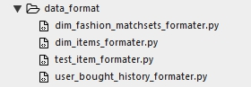
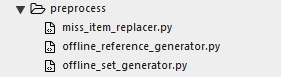
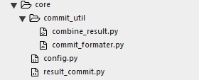
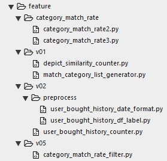

**比赛主页: [淘宝穿衣搭配](https://tianchi.aliyun.com/getStart/introduction.htm?spm=5176.100066.0.0.5184d7806LlRxE&raceId=231575)**

# 1 问题描述

原始数据包含四张表，分别是商品信息，用户购买历史记录，达人匹配商品对和测试商品。我们需要通过这几张表的信息来预测与测试商品搭配的商品。

对于评价函数，需要注意的是预测的匹配商品需要通过概率进行排序，预测靠前的正例得分较高，预测靠前的负例失分较高。

# 2 业务分析

什么原因促进了两个商品的搭配？对于给定的这四张表的思考：1）类别搭配比率较高。2）这一对商品被多个用户购买。3）不同类的商品之间有很多标签相似。因此，可以从这些角度来实现对商品搭配的预测。

# 3 主要工作

1）数据格式化(data format)。将原始数据格式化为csv格式的文本数据。

 

2）数据预处理(preprocess)。

 

2.1）数据划分(offline set generator)。即线下训练及验证的商品集生成。但是后面未使用上模型，仅使用了线下训练商品集作为了线下的验证商品集。

2.2）线下验证数据生成(offline reference generator)。通过线下训练的商品集生成验证数据。

2.3）缺失商品替换(miss item replacer)。在用户购买记录中，仅有2768个测试商品出现，因此需要对未出现的商品进行有效的替换。寻找的替换商品是同类别商品描述相似词最多且出现在购买记录中的商品。

3）核心功能(core)。

 

3.1）文件路径配置(config)。

3.2）线下评价(result commit)。

3.3）线上提交工具(commit util)。

3.31）结果文件生成(commit formater)。

3.32）结果融合(combine result)。把多个结果融合成一个结果，实现的是如果结果A的匹配未满200个，使用B中不含有A中的商品进行填充。

4）特征构造

 

4.1）类别匹配率(category match rate)。

4.11）通过匹配商品生成的匹配率(2)。对于某一类别A能与类别B进行匹配，类别B一共有M个商品，能与类别A匹配的有N个商品，则A与B的匹配率为N/M。

4.12）通过匹配商品与商品总数生成的匹配率(3)。对于匹配集中的商品，类别A能与类别B进行匹配，匹配的商品个数为N，匹配商品中，类别A有M1个商品，类别B有M2个商品，则匹配率为N/(M1+M2-N)。

4.2）通过相似词语个数生成匹配对(depict similarity counter)。首先通过类别匹配率选出匹配率较高的前20%个类别，这20%个类别的商品与测试商品进行匹配，选取相似词语最高的前200个作为预测的匹配商品。

4.3）通过用户购买历史生成匹配对(user bought history counter)。首先划定时间单位，可取1天，7天，15天等作为一个单位的时间，计算单位时间类该用户购买的商品生成含有测试商品的匹配对，通过所有用户生成的匹配对进行匹配对计数，计数越高的商品匹配对最有可能是匹配商品。

4.4）使用类别匹配率进行过滤(category match rate filter)。

# 4 主要阶段

1）计算商品描述的相似词语个数。成绩：2.282679%

2）在1）基础上，加入类别匹配率进行过滤。成绩：3.231569%

3）计算用户购买记录，以一天为单位。成绩：2.424222%

4）对2）3）成绩进行融合。成绩：4.446183%

5）计算商品描述前相似词个数。成绩：5.047922%

6）对4）5）成绩进行融合。成绩：5.486687%

# 5 总结

此次试验的困难之一就是数据不好计算，或者说数据量非常的大。对于5000个预测商品，每个商品对应有200个匹配商品，即每个测试商品对应与大约200个正例，如此算下来大约训练样本中需要含有100万个正例，计算起来也有些复杂，因此算法实现需要更加的有效。对于相似词语个数的计算，最开始跑了12+小时才算出来，后面做算法优化和计算量降低把时间缩短为1+小时，后面经过交流得到，对于这个问题Java有更好的计算性能，对于最开始使用Python 12+小时实现的计算量，Java 20分钟内就完成了，当时也十分惊讶。这里也吸取了不少经验，首先不能太依赖一门语言，应该把各个语言的长处使用出来，才能更好的解决问题。

此次试验自认为较为失败的地方是缺乏目标，缺乏条理。付出工作量较多，但是实现的却很少。想法多了过后就是东一脚，西一脚，最后什么都没做好，很多地方分析到一半就没了，很多时候代码写到一半也没了，工作量上去了，也没出现过结果，最后变成了不了了之。解决方案的框架也没有搭好，最后整个代码框架也十分的混乱，这个点也浪费了不少时间。在代码实现过程中出现了一些低级失误，找问题也没能有清晰直接的思路，所以对于发现问题，分析问题，解决问题的效果较差。

对于上述的的缺点应该注重逻辑结构的搭建，清晰了目标才能更加的高效的解决问题，才能降低了无效的投入。

 

 